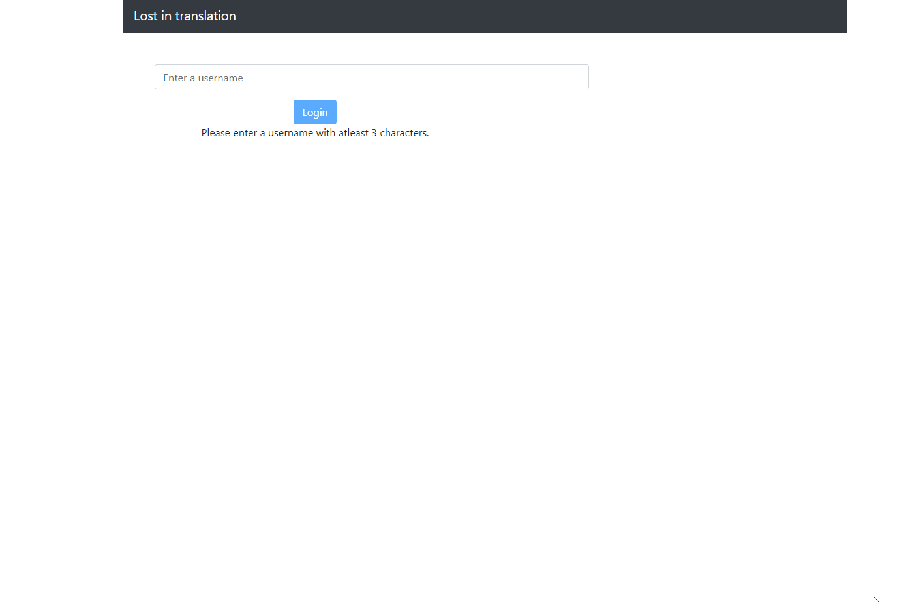

# LostInTranslation

This project is created by [Saleh Hassan](https://github.com/ISaleh-Hassan) and [Hampus Olsson](https://github.com/Heso113) using React framework.

Link to [Heroku](https://lost-in-translation-oof.herokuapp.com)

## About
This application is translator from regular English text to American sign langauage. 

## Features 
-  A user must login to use the functionality of the application. 
- The last 10 translations will be saved in user's profile-page. The user can clear the history any time.
- The application uses localstorge to save search history and user data. The data will be removed automatically when the user logout.

### Usage:

